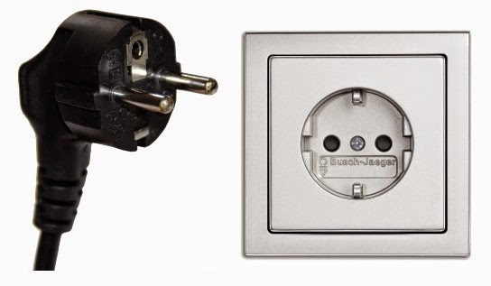

# Steckdosen

Finnland verwendet Steckdosen vom Typ F. Reiseadapter sollten also nicht benötigt werden. Die Netzspannung beträgt 230 V und die Frequenz ist 50 Hz.  
Typ F Steckdosen akzeptieren auch Stecker vom Typ C.

  
Typ F Stecker